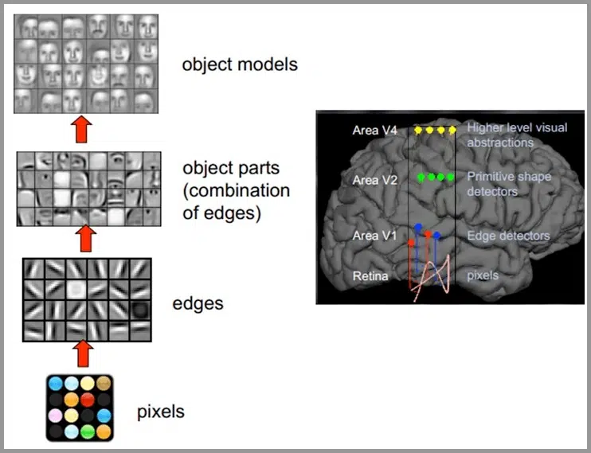
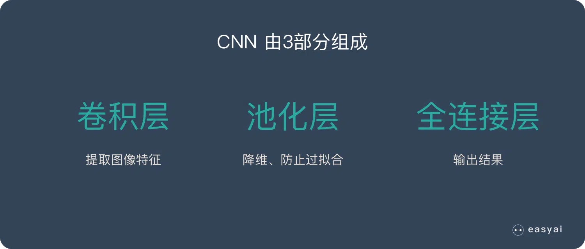
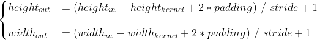

# CNN原理

## CNN(Convolution Neural Network) 卷积神经网络
+ 应用场景：图像类如图像识别/分类、人脸识别、骨骼识别等
+ 灵感来源：人脑成像过程即 像素点 -> 识别边界 -> 捕捉高级特征 -> 判断

+ 神经网络组成结构：卷积层(捕捉特征)、池化层(将复杂的图像降维，如从1000x1000降到256x256或者2x2. 一个化繁为简的过程)、全连接层(输出结果)

+ 图像(256, 256, 3)这里的3是指三个颜色通道，同时卷积核的深度要和输入图像的深度相同
# 卷积层工作原理
+ 用与输入图像相同深度的卷积核对数据进行逐一相乘后相加之后生成feature map的过程。
+ 一个32x32x3的数据由一个5x5x3的卷积核卷积后变成了
+ Relu激活函数公式为max(0, output)
+ 具体流程：

  给定输入图像和输出深度（即输出多少个类） 输出深度决定卷积核数量，图像通道决定卷积核深度，比如：一张224x224x3的图像对应5的输出深度，那么3x3的卷积核就是3x3x3x5

  卷积核与原图像每一个通道的的每一个像素点进行卷积（加权平均值）最后将得到的三张新图叠加即算数求和变成feature map，多少个卷积核对应多少张feature map 

## 池化层工作原理
## ResNet原理

## Attention Mechanism
+ Channel attention
+ ECA Module
+ Local cross-channel interaction
  + 例子： 使用1x1卷积核，实现降维和升维的操作其实就是channel间信息的线性组合变化，3x3，64channels的卷积核后面添加一个1x1，28channels的卷积核，就变成了3x3，28channels的卷积核，原来的64个channels就可以理解为跨通道线性组合变成了28channels，这就是通道间的信息交互[7]。
+ Non-dimensionality